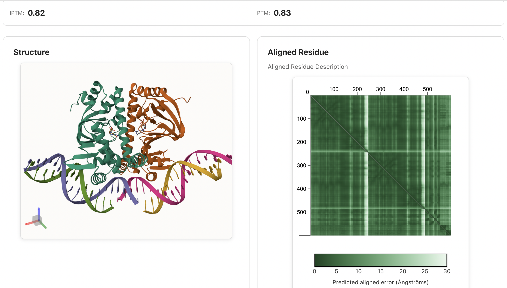

# IntFold: A Controllable Foundation Model for General and Specialized Biomolecular Structure Prediction
[](https://huggingface.co/GAGABIG/CNN)
[](https://pypi.org/project/intfold/)
[](LICENSE)
[](#contact-us)


<div align="center" style="margin: 20px 0;">
  <span style="margin: 0 10px;">⚡ <a href="https://server.intfold.com">IntFold Server</a></span>
  &bull; <span style="margin: 0 10px;">📄 <a href="https://intfold-server-dev.oss-cn-hongkong.aliyuncs.com/IntFold_Technical_Report.pdf">Technical Report</a></span>
</div>


## 🚀 Quick Start

To quickly get started with IntFold, you can use the following commands:
```bash
# Install IntFold from PyPI
pip install intfold
# Run inference with an example YAML file
intfold predict ./examples/5S8I_A.yaml --out_dir ./output
```

## ⚙️ Installation

To more complete installation instructions and usage, please refer to the [Installation Guide](docs/installation.md).


## 🔍 Inference

1. **Prepare Input File**: Create a YAML file with your sequences following our [input format specification](docs/input_yaml_format.md)

2. **Run Prediction**:
   ```bash
   intfold predict your_input.yaml --out_dir ./results
   ```

3. **Check Results**: Find predicted structures and confidence scores in the output directory, you can also check the section of **output format** in [output documentation](docs/input_yaml_format.md#output-format).

4. **Optional Optimization**: Enable [custom kernels](docs/kernels.md) for faster inference and reduced memory usage

For comprehensive usage instructions and examples, refer to the [Usage Guide](docs/usage.md).


## 📊 Benchmarking
To comprehensively evaluate the performance of IntFold, we conducted a rigorous evaluation on [FoldBench](https://github.com/BEAM-Labs/FoldBench). We compared IntFold against several leading methods, including [Boltz-1,2](https://github.com/jwohlwend/boltz), [Chai-1](https://github.com/chaidiscovery/chai-lab), [Protenix](https://github.com/bytedance/Protenix) and [Alphafold3](https://github.com/google-deepmind/alphafold3).

For more details on the benchmarking process and results, please refer to our [Technical Report](https://intfold-server-dev.oss-cn-hongkong.aliyuncs.com/IntFold_Technical_Report.pdf).


## 🌐 IntFold Server

**We highly recommend using the [IntFold Server](https://server.intfold.com) for the most accurate, complete, and convenient biomolecular structure predictions.** It requires no installation and provides an intuitive web interface to submit your sequences and visualize results directly in your browser. The server runs the **full, optimized, latest** IntFold implementation for optimal performance.




## 📜 Citation

If you use IntFold in your research, please cite our paper:

the official citation will be available soon.


## 🔗 Acknowledgements

- The implementation of **fast layernorm operators** is inspired by [OneFlow](https://github.com/Oneflow-Inc/oneflow) and [FastFold](https://github.com/hpcaitech/FastFold), following [Protenix](https://github.com/bytedance/Protenix)'s usage. 
- Many components in `intfold/openfold/` are adapted from [OpenFold](https://github.com/aqlaboratory/openfold), with substantial modifications and improvements by our team (except for the `LayerNorm` part).  
- This repository, the implementation of **Inference Data Pipeline**(Data/Feature Processing and MSA generation tasks) referred to [Boltz-1](https://github.com/jwohlwend/boltz), and modify some codes to adapt to the input of our model.


## ⚖️ License

The IntFold project, including code and model parameters, is made available under the [Apache 2.0 License](./LICENSE), it is free for both academic research and commercial use.

## 📬 Contact Us

If you have any questions or are interested in collaboration, please feel free to contact us at contact@intfold.com.